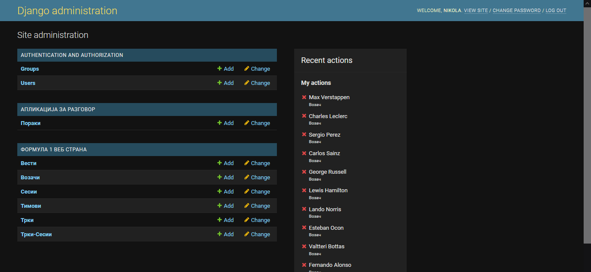

<hr>

[**МКД**](#мкд) / [**ENG**](#eng)<br>
[**Слики**](#слики) / [**Photos**](#photos)
<hr>

# МКД

Сајтот е направен со Python користејќи го Django Web Framework. Податоците за трките и пласманот се превземени со помош на API од [RapidAPI](https://rapidapi.com/), додека пак вестите се земени од македонски портали со помош на Web Scraping со BeautifulSoup4.
<hr>

## За да го вклучите локално:
<br>

1. Инсталација на модули
``` 
python -m pip install -r requirements.txt
```

2. Креирање на `django secret key`
```
python -c "import secrets; print(secrets.token_urlsafe(20))" > django_secret_key.txt
```

3. Креирање на `.env`<br>
Креирате `.env` file и во него внесувате:
```
ST_API_KEY=''
MR_API_KEY=''
DJANGO_SECRET_KEY=${кодот од django_secret_key.txt}
```
- Кодовите за `ST_API_KEY` и `MR_API_KEY` може да ги преземете од [RapidAPI](https://rapidapi.com/)

4. Креирање на `super user`
```
python manage.py createsuperuser
```
5. Миграции
```
python manage.py makemigrations
```
```
python manage.py migrate
```
6. Менување во `DEBUG`
- Во `formula_eden/settings.py` го ставате `DEBUG` на `True` и `HEROKU_PRODUCTION` на `False`
7. Вклучување на сајтот
```
python manage.py runserver
```
8. Ажурирање и промена на податоци
- По вклучувањето на сајтот, податоците може да се ажурираат преку `localhost:8000/manage`
- Промена на податоците се врши преку `localhost:8000/admin`

Ажурирање                  |  Промена
:-------------------------:|:-------------------------:
    |  

# Слики


Одборјување                |  Пренос во живо
:-------------------------:|:-------------------------:
     |  


Новости                    |  Пласман
:-------------------------:|:-------------------------:
   |  


Распоред                   |  Инфо за трка
:-------------------------:|:-------------------------:
  |  

Responsive                 | .
:------------------------:|:----------------------:
 |  

# ENG 

The website is created with Python using Django Web Framework. The data for the races and standings is taken using APIs from [RapidAPI](https://rapidapi.com/), and the news are taken from Macedonian news outlets using Web Scraping with BeautifulSoup4
<hr>

## To run the website locally:
<br>

1. Module installation
``` 
python -m pip install -r requirements.txt
```

2. Creating `django secret key`
```
python -c "import secrets; print(secrets.token_urlsafe(20))" > django_secret_key.txt
```

3. Creating `.env`<br>
Create `.env` file and fill it with:
```
ST_API_KEY=''
MR_API_KEY=''
DJANGO_SECRET_KEY=${кодот од django_secret_key.txt}
```
- You can get the codes for `ST_API_KEY` and `MR_API_KEY` from [RapidAPI](https://rapidapi.com/)

4. Creating `super user`
```
python manage.py createsuperuser
```
5. Migrations
```
python manage.py makemigrations
```
```
python manage.py migrate
```
6. Changing into `DEBUG`
- Inside `formula_eden/settings.py` set `DEBUG` to `True` and `HEROKU_PRODUCTION` to `False`
7. Starting the website
```
python manage.py runserver
```
8. Updating and changing the data
- After starting the website, the data can be updated from `localhost:8000/manage`
- Changing the data can be done from `localhost:8000/admin`

Updating                   |  Changing
:-------------------------:|:-------------------------:
    |  

# Photos


Countdown                  |  Watch it live
:-------------------------:|:-------------------------:
     |  


News                       |  Standings
:-------------------------:|:-------------------------:
   |  


Schedule                   |  Race info
:-------------------------:|:-------------------------:
  |  

Responsive                 | .
:------------------------:|:----------------------:
 |  
